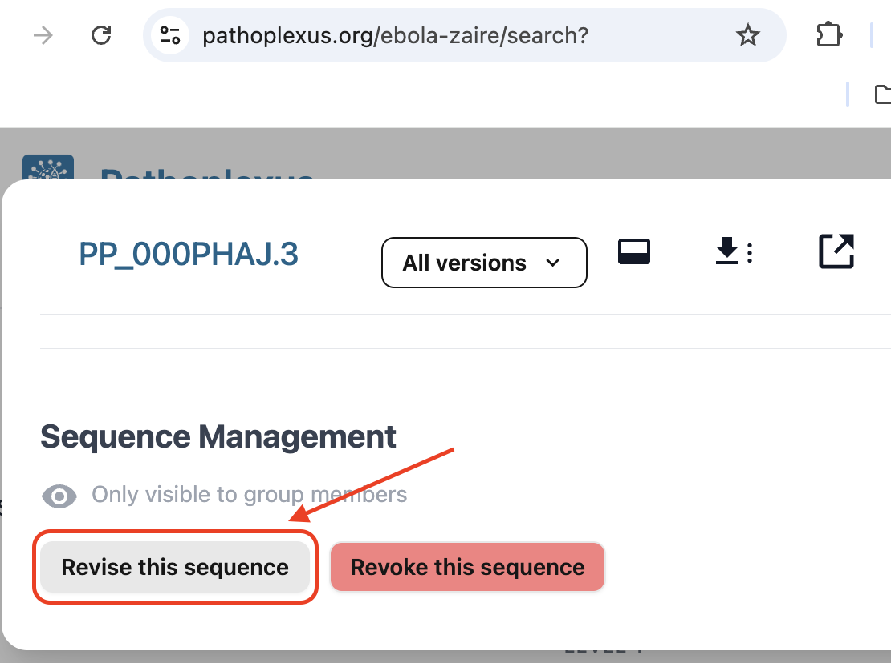
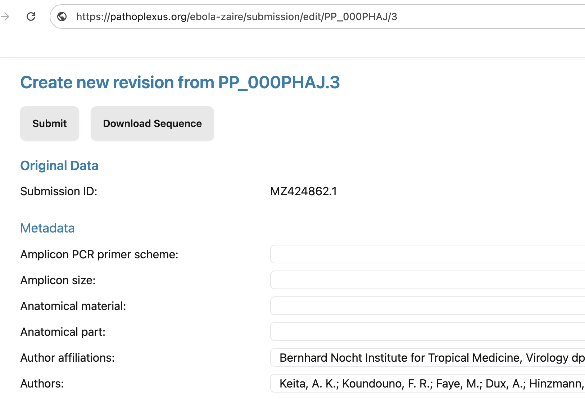
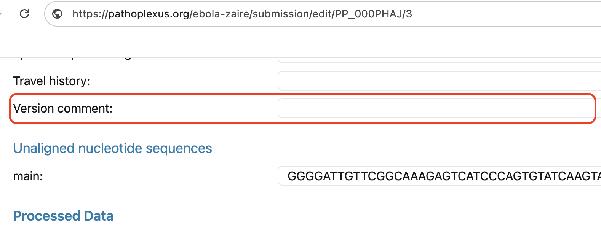

This document provides guidelines for curators on how to review, evaluate, and act upon potential problems reported by users regarding sequence data or metadata errors.

You can see a list of our curators [here](/about/development-team#curators).

## Overview

Curators are responsible for ensuring the accuracy and integrity of the Pathoplexus database. This SOP outlines the steps to follow when reviewing reported problems, the type of evidence to look for, and the process for making decisions on whether to correct, leave open, or close an issue.

## Accessing reported problems

All reported problems are submitted by users to the [Pathoplexus Curation Reports GitHub repository](https://github.com/pathoplexus/curation_reports). Curators should regularly monitor this repository for new GitHub issues.

## Login as curator

For day-to-day use of Pathoplexus please ensure you use your regular user account. When undertaking curation, please log in as a curator. _Ensure you log out after you finish curating!_

## Steps for Reviewing GitHub Issues

### 1. **Initial Review**

- **Read the GitHub Issue:** Carefully read the description provided by the user. Understand the nature of the reported problem with the sequence or metadata.
- **Check the Evidence:** Assess the evidence provided by the user. This may include:
  - Phylogenetic trees or analyses
  - Time-association data
  - Links to peer-reviewed articles or manuscripts
  - Any other reputable sources or data supporting the claim

### 2. **Assess the GitHub Issue**

- **Evaluate the Validity:** Determine whether the evidence presented sufficiently supports the claim of an error.
- **Identify Potential Impact:** Consider the potential implications if the problem raised is true. Does it affect a single sequence, a group of sequences, or have broader implications?
- **Document Any Additional Information:** If needed, conduct your own analysis or research to supplement the information provided.
- **Add Your Thoughts to the GitHub Issue:** Write up your assessment of the evidence and potential impact and add this to the issue chain for the visibility of other users and curators. If you have questions or are requesting additional information, be sure to include this clearly and visibly.

### 3. **Decision Making**

- **Collaborate with Other Curators:**
  - **At least two curators** must agree on the validity of a GitHub issue and the proposed correction.
  - If you believe the GitHub issue has merit, wait for another curator to review and confirm your assessment. You can tag other reviewers to ensure they see the issue.
  - Engage in discussion with other curators if there are differing opinions on the GitHub issue.
- **Determine the Outcome:**
  - **Correct the Problem:** If you and at least one other curator agree that the problem is valid and the proposed correction is appropriate, the problem should be tagged for correction.
  - **Leave the GitHub Issue Open:** If more evidence is needed or further discussion is warranted, leave the issue open for additional input. Add to the issue thread to make clear what additional data or information is needed.
  - **Close the GitHub Issue:** If the evidence is insufficient, or the reported problem is not supported after thorough review, the issue may be closed with a clear explanation provided to the user and public.

### 4. **Handling Disagreements Between Curators**

- **Discussion and Review:** If two curators disagree on the validity of a suspected problem or the proposed correction, they should engage in a detailed discussion within the GitHub issue thread or through another agreed-upon communication channel. The goal is to collaboratively examine the evidence, share perspectives, and reach a consensus.
- **Involve a Third Curator:** If the disagreement persists after discussion, a third curator should be brought in to review the problem. The third curator will provide an independent assessment and help to mediate the disagreement.
- **Majority Decision:** If after involving a third curator the disagreement continues, the decision should be based on a majority vote. If two out of three curators agree on the course of action, that decision will be implemented.
- **Escalation:** In rare cases where consensus cannot be reached, the suspected problem may be escalated to the Pathoplexus Executive Board for final arbitration. The Board will make a binding decision based on the curators' input and the available evidence.

This process ensures that all curators' viewpoints are considered and that decisions are made fairly and collaboratively, maintaining the integrity of the Pathoplexus database.

## Actioning approved corrections

Once a GitHub issue is approved for correction you can proceed with revision - note that the procedure differs slightly for sequences submitted directly to Pathoplexus and those submitted to an INSDC database visible on Pathoplexus.

In both cases is important that you revise sequences using the originally submitted, unprocessed metadata. At the moment this means that unless you have access to the originally submitted metadata (for example if you are the original submitter) you should always revise sequences using the **Revise this Sequence** button at the bottom of a sequence's details page and _not_ using the revise option on the submission portal where you are asked to re-upload all data. We are working on making it easier for curators to download the original metadata.

### Direct submission:

If the problem involves sequences submitted directly to Pathoplexus, contact the submitting group via the email address provided and alert them to the suspected problem. Coordinate with them on whether they can prepare the revision, or if you (or another curator) should. _Be sure_ you or they include a link to the GitHub issue discussing the revision in the `versionComment` field of the metadata, so that the reason for the revision can be easily traced.

**Do not prepare a revision without establishing contact with the submitting group, as they could accept it without realizing.** If they would like you to prepare the revision, do so by signing into your curator account and clicking the revise button at the bottom of the sequence details page (see image above). This will allow you to edit the originally submitted metadata. Revise the submission as agreed upon in the GitHub issue and add a link to that issue in the `Version Comment` metadata field. Alert the submitting group when the revision is ready to be accepted.

**Do not accept the revision. Only the submitting group can do this.**

Once the revision is accepted you can close the GitHub issue.

### INSDC submission:

If the sequence data originates from INSDC, **two different curators** should prepare and accept revisions. When both curators are ready, the first should sign into their curator account and click the revise button at the bottom of the sequence details page (see image above). They should revise the agreed upon fields and add a link to the GitHub issue in the `Version Comment` metadata field (see image above). They should not approve the revision themselves. The second curator should then review the revision and ensure it is as agreed to resolve the problem. The second curator can then accept the revision.

Once the revision is accepted you can close the GitHub issue.

## Bulk curations

Bulk revisions should only be made if a curator has access to the original metadata. As this will not be the case for most curators, please _contact us_ at [revisions@pathoplexus.org](mailto:revisions@pathoplexus.org) if you need to perform a bulk curation and using the revise button is insufficient.

## Documentation and communication

- **Document Decisions:** Record all decisions, including the rationale, in the GitHub issue thread for transparency.
- **Communicate with Users:** Provide feedback to the user who reported the problem, informing them of the outcome, whether their proposed correction was accepted, and any further actions that will be taken. If the data was directly submitted to Pathoplexus, ensure you also communicate with the submitting group.

## Ongoing responsibilities

- **Continuous Monitoring:** Curators should continually monitor the [Curation Reports GitHub repository](https://github.com/pathoplexus/curation_reports) for new issues.
- **Review Open Issues:** Periodically review open GitHub issues to determine if new evidence has surfaced or if additional curatorial input is needed.

---

By following this SOP, curators will help maintain the high standards of accuracy and reliability that are critical to the Pathoplexus database.
