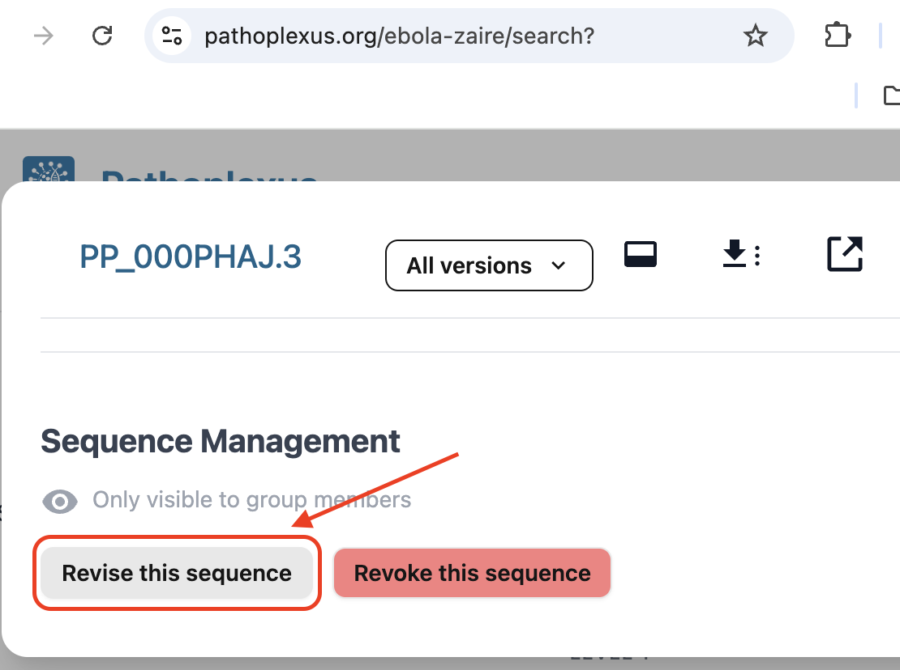
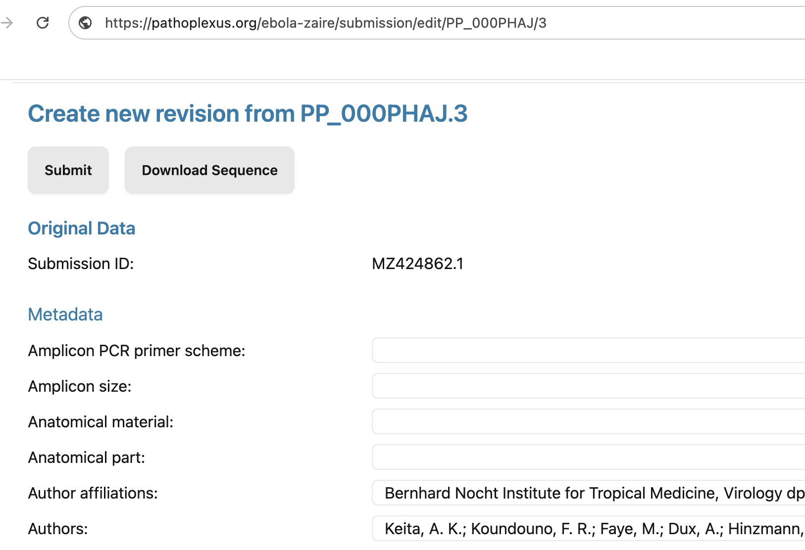
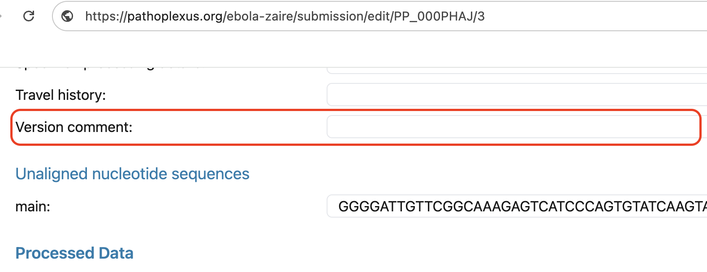

### Contents:

- [Revising an individual sequence](#revising-an-individual-sequence)
- [Submitting and releasing a form revision](#submitting-and-releasing-a-form-revision)
- [Revising multiple sequences with files](#revising-multiple-sequences-with-files)
- [Preparing file-based revisions](#preparing-file-based-revisions)
- [Submitting a file-based revision](#submitting-a-file-based-revision)

Sequences can be corrected or updated after they have been submitted to Pathoplexus.
Submitting these changes ("revisions") will cause the version of the sequence to be incremented, and previous versions of the metadata and sequence data can always be accessed via previous version numbers.
(See [Versioning](/docs/concepts/versioning))

For most changes to a single sequence, use the revision form on that sequence's details page.
This starts from the selected sequence's existing metadata and sequence data, so you do not need to rebuild metadata and FASTA files locally.

Use the file-based workflow later on this page when you need to revise multiple sequences at once, or when you prefer to prepare the revision in metadata and FASTA files.

## Revising an individual sequence

Sign in to an account that has permission to manage the sequence.
Open the sequence details page for the sequence you want to update.
You can find the sequence from the `Browse` section, from the submitting group's review page, or by searching for its accession.

At the bottom of the sequence details page, use the **Revise this sequence** button in the Sequence management section.
If you cannot see this section, check that you are signed in with an account that can manage the submitting group.

The revision form opens with the selected sequence's existing metadata and sequence data.
Edit the fields that need to change.
You can also update the unaligned sequence in the same form if the sequence itself needs to be corrected.

Add a short explanation in the `Version Comment` field describing why the sequence is being revised.
This field is stored as `versionComment` in metadata files and helps future users understand the reason for the new version.

## Submitting and releasing a form revision

Press `Submit` when the form contains the changes you want to make, then confirm the submission.
You will be taken to the review page, where the revised sequence can be checked before release.

Once the revision is released, the changes will appear in the database after a few minutes and the sequence version number will increment.

## Revising multiple sequences with files

The file-based workflow is more complex and is usually only needed for batch revisions.
It is similar to an original submission: you prepare metadata and FASTA files locally, then upload them through the `Revise` option in the submission portal.

The main difference from an original submission is that you must provide an `accession` column in the metadata file, containing the Pathoplexus accession number assigned when each sequence was submitted originally.

**Important:** The `accession` column should contain the accession **without** the version number. For example, use `PP_0049AAG` rather than `PP_0049AAG.1`. (See [Accessions](/docs/concepts/accession) for more information on accession format.)

**You must use the _original metadata_ when doing a file-based revision!** (In other words, the original files you submitted to Pathoplexus.) Currently you will need to have this file locally - we aim to introduce a way to download this from Pathoplexus soon. If you do not have this file, please _contact us_ at [revisions@pathoplexus.org](mailto:revisions@pathoplexus.org) to help you do the revision.

## Preparing file-based revisions

### Editing the metadata

#### How to create the metadata file

The metadata file should include all the metadata fields that were originally included, **both** those that you wish to update and that should remain the same. (Not including a metadata column will set its value to 'empty'.)

#### Creating a matching FASTA file

Even if you are not revising the sequence, you must provide a FASTA file that matches the metadata file you are uploading.
It should only contain the sequences that are in the metadata file (if this is fewer than your original submission), and does not otherwise need to be edited. If you are submitting sequences to a multi-segmented organism and you submit more than one segment per entry, add a column `fastaIds` to your metadata, with a space-separated list of all fasta IDs that should be linked to a specific metadata entry.

You can also edit the sequence at the same time as revising the metadata - simply prepare the FASTA file as explained in [Editing the sequence](#editing-the-sequence).

### Editing the sequence

#### Creating the FASTA file

Create a FASTA file that contains only the sequences you'd like to revise, with whatever changes you'd like to make.
There is no reason to edit the sequence IDs in the FASTA file, as long as they still match the fasta IDs listed in the `id` column (for single-segmented) or `fastaIds` column (for multi-segmented organisms) in your metadata file.

#### Creating the metadata file

The metadata file should only have rows of data for the sequences in the FASTA file.
It needs to include an `accession` column, which includes the Pathoplexus accessions assigned at initial submission (without the version number, e.g., `PP_0049AAG` not `PP_0049AAG.1`).

You should also include the metadata `id` column, which will match the sequence ids in your FASTA file for single-segmented organisms. For multi-segmented organisms you should include both the metadata `id` column and a `fastaIds` column with a space-separated list of the fasta IDs of all sequences that should be linked to that metadata entry.
If you want to edit any metadata fields as well, you can include these as described in [Editing the metadata](#editing-the-metadata).

We also encourage you to add a short description or summary in the optional `versionComment` metadata field describing the reason for revising the sequence.

## Submitting a file-based revision

To submit a revision, navigate to the `Submit` section of the Pathoplexus website using the link in the top-right corner of the website.
Select the correct pathogen if requested, or ensure you're submitting to the correct pathogen database via the drop-down on the top-left of the website.

When on the page with 'Submit', 'Revise', 'Review', and 'View' boxes, select 'Revise'.

Just as with an original submission, drag and drop (or select) the files where you have made the appropriate revisions.
**Ensure you specify the same Terms of Data as you previously chose for your sequences.**
Press 'Submit'.

You will be directed to the same processing page as you're taken to during initial submission, where you can view the sequences and their changes before releasing them.
Once released, these changes will appear in the database after a few minutes, with the version numbers incremented.
