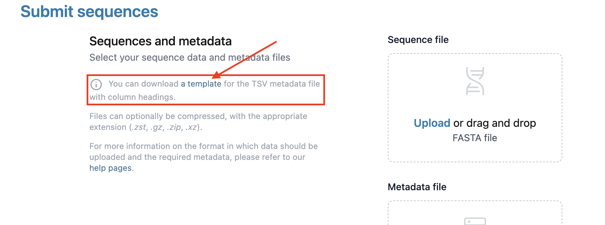

import InfoBox from '../../../components/asides/InfoBox.astro';

You can only upload sequences if you have [created an account](create-account) and are part of a [group](create-group).

Before you begin this process, you should ensure your data is in the correct format. Each sequence should have a unique submissionID that can be used to associate it with its corresponding metadata entry.

Loculus expects:

- Sequence data in `fasta` format with a unique submissionID per sequence.
- Metadata in `tsv` format for each sequence. You can read more about the required metadata fields [here](../concepts/metadataformat). If you need help formatting metadata we offer a metadata template for each organism on the submission page.



The files can also be compressed: accepted formats are .zst, .gz, .zip and .xz.


_You can try out uploading sequences to our [Demo Instance](https://demo.pathoplexus.org/) - it works just like the 'real' Pathoplexus, but is wiped regularly and **no data is sent onward to INSDC**. We also have some [example data](https://pathoplexus.github.io/example_data/) you can upload to the Demo Instance._


### Multi-segmented Pathogens

Pathoplexus expects multi-segmented pathogens to have one unique submissionID per **isolate** (pathogen sample containing all segments). However, `fasta` files should still have a separate entry/record per segment. Therefore, each record id should include the unique submissionID of the isolate and the segment name, for example: `submissionID + '_' + segmentName`. The metadata is uploaded per isolate, i.e. there will be only one row for each `submissionID` and segmented metadata parameters need to be uploaded individually, i.e. under `length_{segmentName}` etc.

## Website

Uploading sequences via the website is a very way to submit sequences without having to worry about any code.

1. Log into your account, and then click 'Submit' in the top-right corner of the website
2. Select the organism that you'd like to submit sequences for
3. Drag-and-drop a `fasta` file with the sequences and a metadata file with the associated metadata into the box on the website, or click the 'Upload a file' link within the boxes to open a file-selection box
4. Select the Terms of Use that you would like for your data. You can read more about the **Terms of Use** [here](/about/terms-of-use/data-use-terms). If you choose 'Restricted' - set the time limit for the restriction, up to 1 year
5. Select 'Submit sequences' at the bottom of the page

The data will now be processed, and you will have to approve your submission before it is finalized. You can see how to do this [here](approve-submissions).

## Uploading raw reads

Pathoplexus currently only accepts consensus sequence submissions. If you wish to upload raw reads, you can do so directly through the [INSDC submission portal](https://ena-docs.readthedocs.io/en/latest/submit/reads.html).

To ensure your raw reads are linked to your consensus sequence in the INSDC, both must be associated with the same biosample and bioproject at the time of submission.

#### Submission Scenarios:
- Submitting the Consensus Sequence First (via Pathoplexus):
After submitting your consensus sequence to Pathoplexus, use the biosample and bioproject accessions we provide (e.g., Bioproject Accession: PRJEB80643, Biosample Accession: SAMEA116354847) when submitting your raw reads to the INSDC.

- Submitting Raw Reads First (via INSDC):
If you submit raw reads to the INSDC first, create a biosample and bioproject during the upload process. Then, provide the raw reads accession in the metadata.tsv (e.g., insdcRawReadsAccession=SRR27477368) when submitting your consensus sequence to Pathoplexus. This allows us to link your consensus sequence to the raw reads in the INSDC.

Please contact us at `submission@pathoplexus.org` if you have any questions about submitting raw reads. 


## API

<InfoBox>
    To use the [demo instance](https://demo.pathoplexus.org) instead of the main instance, please replace `backend.pathoplexus.org` with `backend-demo.pathoplexus.org`.
</InfoBox>

**By using our API you agree to our [Data Use Terms](/about/terms-of-use/data-use-terms).**

It is currently possible to upload sequences through an HTTP API. We also plan to release a command-line interface before the end of 2024.

To upload sequences through the HTTP API you will need to:


1. Retrieve an authentication JSON web token: see the [Authenticating via API guide](/docs/how-to/authentication-api).
2. Identify the Group ID of your group: you can find it on the page of your group (which can be reached from your [user page](/user)).
3. Send a POST request:
    - To upload sequences with the **open use terms**: `https://backend.pathoplexus.org/<organism>/submit?groupId=<   group id>&dataUseTermsType=OPEN`

    - To upload sequences with the **restricted use terms**: `https://backend.pathoplexus.org/<organism>/submit?groupId=<group id>&dataUseTermsType=RESTRICTED&restrictedUntil=<restricted-until-date>`

    - The available values for the organism are: `cchf`, `ebola-sudan`, `ebola-zaire` and `west-nile`.
    - The restricted-until date must be provided in the ISO format (e.g., 2024-08-27).
    - The header should contain
        - `Authorization: Bearer <authentication-token>`
        - `Content-Type: multipart/form-data`
    - The request body should contain the FASTA and metadata TSV files with the keys `sequenceFile` and `metadataFile`


With cURL, the corresponding command for sending the POST request can be:

```
curl -X 'POST' \
  'https://backend.pathoplexus.org/<organism>/submit?groupId=<group id>&dataUseTermsType=OPEN' \
  -H 'accept: application/json' \
  -H 'Authorization: Bearer <authentication token>' \
  -H 'Content-Type: multipart/form-data' \
  -F 'metadataFile=@<metadata file name>' \
  -F 'sequenceFile=@<fasta file name>'
```

Further information can be found in our [Swagger API documentation](https://backend.pathoplexus.org/swagger-ui/index.html#/submission-controller/submit).

As with the website, data will now be processed, and you will have to approve your submission before it is finalized. You can see how to do this [here](approve-submissions).
