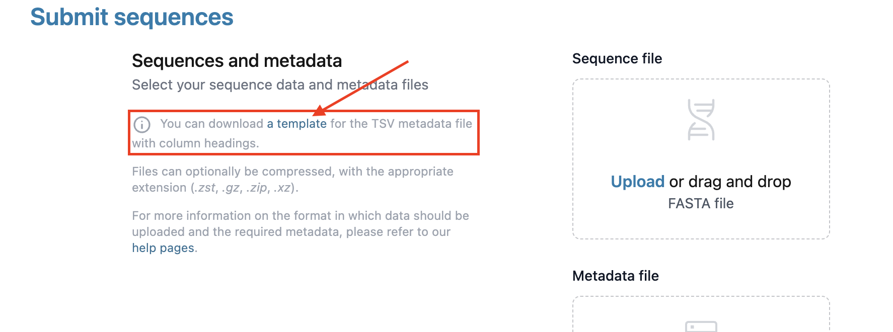

import InfoBox from '../../../components/asides/InfoBox.astro';

The process of submitting sequences to Pathoplexus consists of three sequential steps; sequence upload, review/editing, and approval.
Submitting sequences to Pathoplexus requires you to have [created an account](create-account) and to be part of a [group](create-group).
If you already have an account and belong to more than one group, make sure that the appropriate group you are currently submitting sequences for is selected from the drop-down menu in the top left before proceeding with the submission process.

Before starting the upload process, ensure that your data is correctly formatted. Every sequence must have a unique ID that can be used to link it with its metadata entry. 

<InfoBox>
**Terminal Ns will be automatically removed** during sequence preprocessing and will not be included in the submitted sequences.
</InfoBox>

### Expected data format

- Sequence data in `fasta` format with a unique fasta ID per sequence. The fasta ID is the start of the header up to and excluding the first white space character. For example the fasta header `>seq_12` has fasta ID `seq_12`.
- Raw reads files in `fastq` format (optional).
- Metadata for each sample with a unique `id`.
  - When uploading through the API, only `tsv` is supported.
  - When uploading through the website, `xlsx` files are also accepted.
  - Each organism has its own metadata template available on the submission page.
  - On the website, you can map columns from your file to the expected metadata fields using the **Add column mapping** option.

The metadata and sequence data files can be compressed: accepted formats here are .zst, .gz, .zip and .xz. Raw reads files may also be compressed, but only using the .gz format (to facilitate submission to INSDC).

Metadata and sequences will be matched using the `id` column in the metadata (i.e., the sequence with fasta ID `seq_12` will be joined with the metadata entry with `id` of `seq_12`). You can also provide an additional metadata field called `fastaIds` containing a space-separated list of fasta IDs to link multiple sequences to a single submission, e.g., `seq_12_A seq_12_B`. This can for example be used when submitting multi-segmented pathogens.

Similarly, raw reads files will be associated to their corresponding consensus sequence via the `files.rawReads` metadata field. This field should contain a space-separated list of file names indicating which raw reads files belong to which sequence. Raw reads for the full submission should be uploaded as a single folder containing raw reads files for all sequences (see [here](/docs/how-to/upload-raw-reads) for a detailed description of how to attach raw reads files).



<InfoBox>
You can try out uploading sequences to our [Demo Instance](https://demo.pathoplexus.org/) - it works just like the 'real' Pathoplexus, but is wiped regularly and **no data is sent onward to INSDC**. We also have some [example data](https://pathoplexus.github.io/example_data/) you can upload to the Demo Instance.
</InfoBox>


### Multi-segmented Pathogens

Multi-segmented pathogens must have one unique `id` per **isolate** (i.e., one per pathogen sample containing all segments). Each segment will be a unique entry in the FASTA file with its own FASTA ID. Metadata is uploaded per isolate, meaning there will be a single metadata row per `id`. This row should include a `fastaIds` field listing all segment fasta IDs, separated by spaces.

### Using your own Bioproject

Sequences uploaded to Patholexus will be submitted to the INSDC under a Bioproject that Pathoplexus creates itself. If you would like your sequences to be attached to another Bioproject, you may provide the accession of that Bioproject (starting with `PRJ`) in the `bioprojectAccession` metadata field when submitting to Pathoplexus. If you do this, please ensure that the Bioproject exists, is public, and is **not** an umbrella Bioproject. Not doing so could cause a delayed or failed propagation of your sequences to the INSDC.

## Website

Uploading sequences via the website is an easy way to submit sequences without having to worry about any code.

1. Log into your account, and then click 'Submit sequences' on the landing page.
2. Select the organism that you'd like to submit sequences for.
3. Drag-and-drop a `fasta` file with the sequences and a metadata file with the associated metadata into the box on the website, or click the 'Upload a file' link within the boxes to open a file-selection box.
4. Optional: upload the raw reads that were used to derive the consensus sequence. This is done by clicking the 'Upload folder: Raw reads' or the 'Upload files' box on the submission page, which will ask you to select a folder or file(s) containing the raw reads files, respectively.
5. Select the Terms of Use that you would like for your data. You can read more about the **Terms of Use** [here](/about/terms-of-use/data-use-terms). If you choose 'Restricted' - set the time limit for the restriction, up to 1 year.
6. Select 'Upload and proceed to Approval' at the bottom of the page.

The data will now be processed, and you will have to approve your submission before it is finalized. You can see how to do this [here](approve-submissions).

<InfoBox>
If you have selected `Restricted` in the terms of use for your sequences, a restriction period of up to one year from the date of submission will be set automatically. You can customize this to an earlier date of your choice by using the `Change Date` button before proceeding with submission.

You can also modify the restriction period after submission. Note you can only shorten the period or make sequences `Open`, you cannot extend the restriction period. You will need to be logged in as a user with the appropriate authorization to make these changes.
</InfoBox>


## API

<InfoBox>
    To use the [demo instance](https://demo.pathoplexus.org) instead of the main instance, please replace `backend.pathoplexus.org` with `backend-demo.pathoplexus.org`.
</InfoBox>

**By using our API you agree to our [Data Use Terms](/about/terms-of-use/data-use-terms).**

It is currently possible to upload sequences through an HTTP API. We also plan to release a command-line interface.

To upload sequences through the HTTP API you will need to:


1. Retrieve an authentication JSON web token: see the [Authenticating via API guide](/docs/how-to/authentication-api).
2. Identify the Group ID of your group: you can find it on the page of your group (which can be reached from your [user page](/user)).
3. Send a POST request:
    - To upload sequences with the **open use terms**: `https://backend.pathoplexus.org/<organism>/submit?groupId=<GROUPID>&dataUseTermsType=OPEN`

    - To upload sequences with the **restricted use terms**: `https://backend.pathoplexus.org/<organism>/submit?groupId=<GROUPID>&dataUseTermsType=RESTRICTED&restrictedUntil=<restricted-until-date>`

    - API upload is available for all pathogens on Pathoplexus. You can find the correct term to use in place of `<organism>` by using the value in the URL when you navigate to browse sequences from that Pathogen. For example, for West Nile Virus, the URL is `https://pathoplexus.org/west-nile/search?` and thus `<organism>` is `west-nile`.
    - The restricted-until date must be provided in the ISO format (e.g., 2024-08-27).
    - The header should contain
        - `Authorization: Bearer <authentication-token>`
        - `Content-Type: multipart/form-data`
    - The request body should contain the FASTA and metadata TSV files with the keys `sequenceFile` and `metadataFile`


With cURL, the corresponding command for sending the POST request can be:

```
curl -X 'POST' \
  'https://backend.pathoplexus.org/<organism>/submit?groupId=<GROUPID>&dataUseTermsType=OPEN' \
  -H 'accept: application/json' \
  -H 'Authorization: Bearer <authentication token>' \
  -H 'Content-Type: multipart/form-data' \
  -F 'metadataFile=@<metadata file name>' \
  -F 'sequenceFile=@<fasta file name>'
```

Further information can be found in our [Swagger API documentation](https://backend.pathoplexus.org/swagger-ui/index.html#/submission-controller/submit).

As with the website, data will now be processed, and you will have to approve your submission before it is finalized. You can see how to do this [here](approve-submissions).
